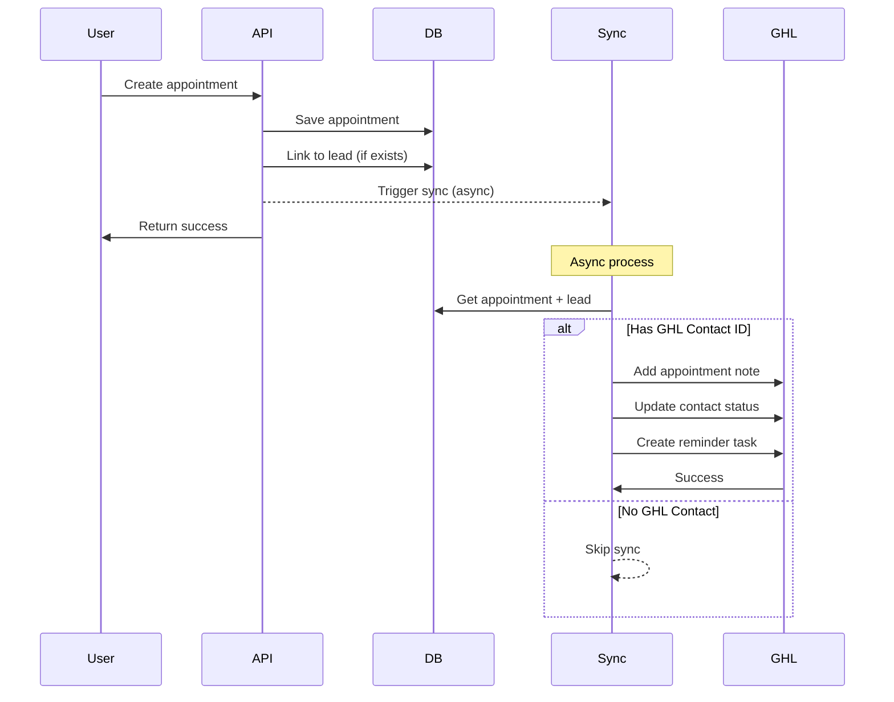
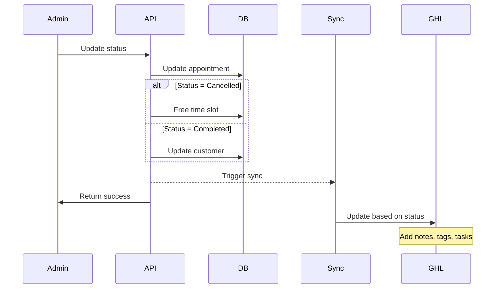

# GoHighLevel Bidirectional Sync Documentation

## Overview

The GoHighLevel Bidirectional Sync system provides real-time synchronization of appointment data between StayCool Airco's booking system and GoHighLevel CRM. This ensures that both systems remain up-to-date with the latest appointment information, customer interactions, and status changes.

## 🚀 Features

### Core Capabilities
- **Real-time Sync**: Appointment changes are synchronized immediately
- **Bidirectional Flow**: 
  - GoHighLevel → StayCool: Lead creation via webhooks
  - StayCool → GoHighLevel: Appointment updates and confirmations
- **Error Resilience**: Automatic retry with exponential backoff
- **Dead Letter Queue**: Failed syncs are captured for manual recovery
- **Monitoring & Analytics**: Real-time sync health monitoring
- **Idempotency**: Prevents duplicate syncs with request caching

### Supported Operations
1. **Appointment Creation** - New appointments sync to GHL with notes and tasks
2. **Appointment Confirmation** - Customer confirmations update GHL contact status
3. **Appointment Cancellation** - Cancellations trigger follow-up tasks in GHL
4. **Appointment Completion** - Service completion marks customers and creates satisfaction tasks
5. **Appointment Updates** - Any changes sync to maintain data consistency

## 📁 Architecture

### System Components

```
┌─────────────────────────────────────────────────────────────────┐
│                        StayCool Airco System                      │
├─────────────────────────────────────────────────────────────────┤
│                                                                   │
│  ┌─────────────────┐     ┌─────────────────────┐                │
│  │  Appointment    │────▶│   Sync Service      │                │
│  │  API Endpoints  │     │ (Trigger Function)  │                │
│  └─────────────────┘     └──────────┬──────────┘                │
│                                     │                            │
│  ┌─────────────────┐                ▼                            │
│  │   Database      │     ┌─────────────────────┐                │
│  │  (PostgreSQL)   │     │  Netlify Function   │                │
│  └─────────────────┘     │  (Sync Handler)     │                │
│                          └──────────┬──────────┘                │
└─────────────────────────────────────┼────────────────────────────┘
                                     │
                                     ▼
                          ┌─────────────────────┐
                          │   GHL API Client    │
                          │  (Retry & Error     │
                          │   Handling)         │
                          └──────────┬──────────┘
                                     │
                                     ▼
                          ┌─────────────────────┐
                          │   GoHighLevel API   │
                          │   (v2 - 2024)       │
                          └─────────────────────┘
```

### File Structure
```
lib/services/gohighlevel/
├── ghl-api-client.ts              # API client with retry logic
└── appointment-sync.service.ts    # Sync trigger service

netlify/functions/
├── gohighlevel-webhook.ts         # Incoming webhook handler
├── gohighlevel-appointment-sync.ts # Outgoing sync handler
└── gohighlevel-sync-monitor.ts   # Monitoring & analytics

app/api/appointments/
├── create-with-sync/route.ts      # Create appointments with sync
└── status/route.ts                # Update status with sync

__tests__/
└── gohighlevel-appointment-sync.test.ts # Integration tests
```

## 🔧 API Reference

### 1. Appointment Sync Endpoint

**URL**: `/.netlify/functions/gohighlevel-appointment-sync`  
**Method**: `POST`  
**Authentication**: Internal (Netlify Functions)

**Request Body**:
```json
{
  "appointmentId": "uuid",
  "action": "create" | "update" | "confirm" | "cancel" | "complete",
  "timestamp": "2024-01-15T10:00:00Z" // Optional
}
```

**Success Response** (200):
```json
{
  "success": true,
  "appointmentId": "uuid",
  "action": "confirm",
  "ghlContactId": "ghl_contact_123",
  "syncDetails": {
    "notesCreated": true,
    "contactUpdated": true,
    "taskCreated": true,
    "tagsApplied": ["appointment-confirmed"],
    "customFieldsUpdated": {
      "appointment_status": "confirmed",
      "next_appointment_date": "2024-01-20"
    }
  },
  "timestamp": "2024-01-15T10:00:00Z",
  "processingTime": 245
}
```

**Error Response** (500):
```json
{
  "success": false,
  "error": "Sync failed",
  "message": "Rate limit exceeded",
  "retryable": true,
  "appointmentId": "uuid",
  "retryAfter": 60
}
```

### 2. Sync Monitor Endpoint

**URL**: `/.netlify/functions/gohighlevel-sync-monitor`  
**Method**: `GET`  
**Authentication**: Internal (Netlify Functions)

**Query Parameters**:
- `action`: `status` | `retry` | `health` (default: `status`)
- `appointmentId`: Filter by specific appointment (optional)

**Example Requests**:
```
GET ?action=status                    # Overall sync status
GET ?action=status&appointmentId=uuid # Status for specific appointment
GET ?action=retry                     # Retry failed syncs
GET ?action=health                    # System health check
```

**Status Response**:
```json
{
  "success": true,
  "action": "status",
  "data": {
    "totalSyncs": 1250,
    "successful": 1195,
    "failed": 55,
    "successRate": 95.6,
    "deadLetterQueueSize": 12,
    "recentFailures": [
      {
        "appointmentId": "uuid",
        "error": "Network timeout",
        "attempts": 3,
        "lastAttempt": "2024-01-15T09:45:00Z"
      }
    ],
    "systemHealth": {
      "status": "degraded",
      "issues": ["High failure rate in last hour: 15 failures"],
      "checks": {
        "environment": true,
        "syncPerformance": false,
        "deadLetterQueue": true
      }
    },
    "recommendations": [
      "Investigate sync failures - success rate below 90%",
      "Check GoHighLevel API status and rate limits"
    ]
  }
}
```

## 🔄 Sync Workflows

### 1. Appointment Creation Flow



### 2. Status Update Flow



## 🚨 Error Handling

### Error Types

1. **Network Errors**
   - Timeouts (30s limit)
   - Connection failures
   - DNS resolution issues

2. **API Errors**
   - Rate limiting (429)
   - Authentication failures (401)
   - Server errors (500-599)

3. **Data Errors**
   - Missing GHL contact ID
   - Invalid appointment data
   - Validation failures

### Retry Strategy

```typescript
// Exponential backoff with jitter
const retryDelay = Math.min(
  baseDelay * Math.pow(2, attempt),
  MAX_RETRY_DELAY
) + jitter;

// Retry limits
MAX_RETRIES = 3
INITIAL_DELAY = 1000ms
MAX_DELAY = 30000ms
JITTER = 30% of delay
```

### Dead Letter Queue

Failed syncs after all retries are stored in memory (production should use Redis):

```typescript
interface DeadLetterEntry {
  id: string;
  appointmentId: string;
  action: string;
  payload: any;
  error: string;
  attempts: number;
  createdAt: Date;
  lastAttempt: Date;
}
```

### Manual Recovery

Use the monitor endpoint to retry failed syncs:

```bash
# Check failed syncs
curl "https://your-domain/.netlify/functions/gohighlevel-sync-monitor?action=status"

# Retry all failed syncs
curl "https://your-domain/.netlify/functions/gohighlevel-sync-monitor?action=retry"
```

## 📊 Monitoring & Alerts

### Key Metrics

| Metric | Target | Alert Threshold |
|--------|--------|-----------------|
| Success Rate | >95% | <90% |
| Dead Letter Queue | <20 | >50 |
| Sync Latency | <5s | >10s |
| API Response Time | <1s | >3s |
| Rate Limit Usage | <80% | >90% |

### Health Check Indicators

```json
{
  "status": "healthy" | "degraded" | "unhealthy",
  "checks": {
    "environment": true,      // Required env vars present
    "syncPerformance": true,  // Success rate >90%
    "deadLetterQueue": true,  // Queue size <50
    "recentFailures": true    // <10 failures/hour
  }
}
```

### Monitoring Dashboard

The sync monitor provides real-time visibility:
- Total syncs and success rate
- Dead letter queue status
- Recent failure patterns
- System health status
- Actionable recommendations

## 🔐 Security Considerations

### API Security
- Bearer token authentication for GHL API
- Environment variable storage for credentials
- No sensitive data in logs
- Request validation with Zod schemas

### Data Protection
- PII handling compliance
- Minimal data in sync payloads
- Audit trail for all operations
- Secure error messages (no data leakage)

### Rate Limiting
- Client-side rate limiting (10 req/s)
- Respect GHL limits (100 req/10s, 200k/day)
- Automatic backoff on 429 responses
- Queue management to prevent bursts

## 🛠️ Configuration

### Environment Variables

```bash
# GoHighLevel API
GHL_API_KEY=your_api_key
GHL_LOCATION_ID=your_location_id

# Database
DATABASE_URL=postgresql://...

# Security
JWT_SECRET=your_jwt_secret

# URLs
NETLIFY_URL=https://your-domain.netlify.app
BOOKING_BASE_URL=https://afspraak.staycoolairco.nl

# Optional
GHL_SKIP_SIGNATURE_VALIDATION=false
NODE_ENV=production
```

### Feature Flags

```typescript
// Enable/disable sync features
const SYNC_CONFIG = {
  enabled: true,
  asyncMode: true,           // Don't block API responses
  retryOnFailure: true,      // Auto-retry failed syncs
  maxRetries: 3,             // Max retry attempts
  retryDelay: 5 * 60 * 1000, // 5 minute retry delay
};
```

## 🚀 Deployment

### Local Development

```bash
# Install dependencies
npm install

# Run tests
npm test gohighlevel-appointment-sync.test.ts

# Start Netlify dev server
netlify dev

# Test sync endpoint
curl -X POST http://localhost:8888/.netlify/functions/gohighlevel-appointment-sync \
  -H "Content-Type: application/json" \
  -d '{"appointmentId": "test-123", "action": "create"}'
```

### Production Deployment

1. **Environment Setup**
   ```bash
   netlify env:set GHL_API_KEY your_api_key
   netlify env:set GHL_LOCATION_ID your_location_id
   ```

2. **Deploy Functions**
   ```bash
   netlify deploy --prod
   ```

3. **Verify Deployment**
   ```bash
   # Health check
   curl https://your-domain/.netlify/functions/gohighlevel-sync-monitor?action=health
   ```

## 📈 Performance Optimization

### Caching Strategy
- Successful sync results cached for idempotency
- Cache size limited to 1000 entries
- LRU eviction for old entries
- 5-minute cache TTL

### Database Optimization
- Indexed fields for fast lookups
- Includes to reduce query count
- Transaction usage for consistency
- Connection pooling

### API Client Optimization
- Request batching where possible
- Connection reuse
- Parallel operations for independent calls
- Smart rate limiting

## 🧪 Testing

### Unit Tests
```bash
npm test gohighlevel-appointment-sync.test.ts
```

### Integration Testing
1. Create test appointment with GHL lead
2. Trigger sync with various actions
3. Verify GHL contact updates
4. Test error scenarios
5. Validate monitoring endpoints

### Load Testing
```bash
# Simulate concurrent syncs
for i in {1..100}; do
  curl -X POST $SYNC_ENDPOINT -d "{...}" &
done
```

## 🔍 Troubleshooting

### Common Issues

1. **"No GoHighLevel contact associated"**
   - Ensure lead was created from GHL webhook
   - Check `ghlContactId` field in leads table
   - Verify webhook is properly configured

2. **Rate Limit Errors**
   - Check current usage in monitor
   - Implement request queuing
   - Increase retry delays

3. **Network Timeouts**
   - Verify GHL API status
   - Check network connectivity
   - Increase timeout limits

4. **Sync Not Triggering**
   - Verify async flag is true
   - Check for errors in console
   - Ensure environment variables set

### Debug Mode

Enable detailed logging:
```typescript
// In sync handler
console.debug('Sync details', {
  appointment,
  lead,
  ghlContactId,
  action,
  timestamp: new Date().toISOString()
});
```

### Manual Sync Trigger

```bash
# Direct sync call
curl -X POST https://your-domain/.netlify/functions/gohighlevel-appointment-sync \
  -H "Content-Type: application/json" \
  -d '{
    "appointmentId": "actual-uuid-here",
    "action": "confirm",
    "timestamp": "2024-01-15T10:00:00Z"
  }'
```

## 📅 Maintenance

### Regular Tasks
1. **Daily**: Check sync success rate
2. **Weekly**: Review dead letter queue
3. **Monthly**: Analyze performance metrics
4. **Quarterly**: Update GHL API integration

### Monitoring Checklist
- [ ] Success rate >95%
- [ ] Dead letter queue <20 items
- [ ] No repeated errors in logs
- [ ] API response times <1s
- [ ] All health checks passing

## 🎯 Future Enhancements

1. **Redis Integration**
   - Persistent dead letter queue
   - Distributed rate limiting
   - Session caching

2. **Webhook Events**
   - Send webhooks on sync failures
   - Real-time monitoring alerts
   - Slack/Discord notifications

3. **Advanced Sync**
   - Bulk appointment sync
   - Historical data migration
   - Two-way status sync

4. **Analytics Dashboard**
   - Visual monitoring UI
   - Performance graphs
   - Error pattern analysis

---

## 📝 Summary

The GoHighLevel Bidirectional Sync system provides a robust, fault-tolerant integration between StayCool's appointment system and GoHighLevel CRM. With automatic retry logic, comprehensive error handling, and real-time monitoring, it ensures reliable data synchronization while maintaining system performance and security.